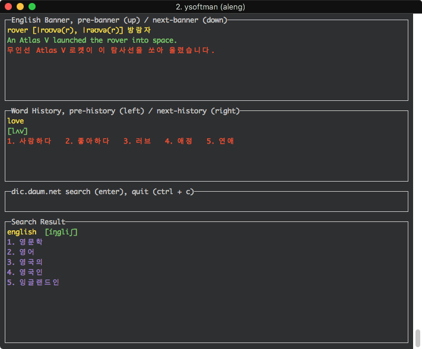

# aleng (Always English) :smile:
콘솔에서 영어 단어, 문장 보기
- eng.dic 에 영어 단어, 문장을 명시한것 배너로 표시
- 인터넷에서 단어 검색

build
```bash
go get -u "github.com/mattn/go-runewidth"
go get -u "github.com/nsf/termbox-go"
go get -u "github.com/PuerkitoBio/goquery"
go get -u "github.com/fatih/color"
go get -u "github.com/ysoftman/gocui"
# 또는 glide 사용시 (https://github.com/Masterminds/glide)
glide install

# 빌드
go build

# 실행
./aleng
```

screenshot


