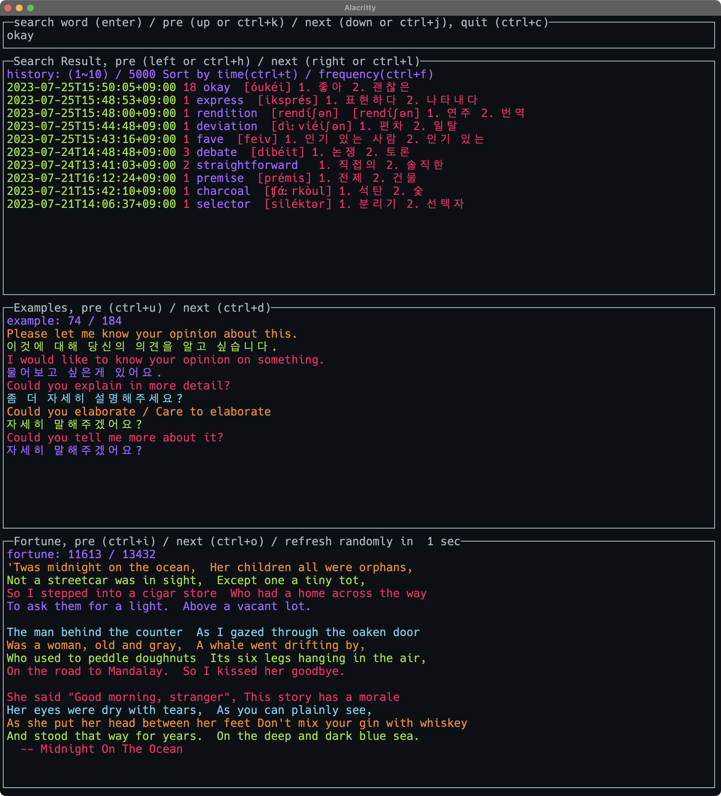

# aleng (Always English :smile:)

터미널에서 영어 단어, 문장 보기

- 인터넷에서 단어 검색
- 찾은 단어 기록 및 표시
- 영어 단어/문장 배너 표시

build

```bash
# gocui 한글출력 이슈 수정 커밋을 go.mod 에 추가
go get github.com/ysoftman/gocui@65dddcdf2d5d134e083e0fd9481b3179ec87e6d5
go get -u ./...

# fortune command 설치
# mac
brew install fortune
# ubuntu
apt-get install fortune

# 빌드
go build

# ad hoc 실행
./aleng love

# 실행
./aleng
```


